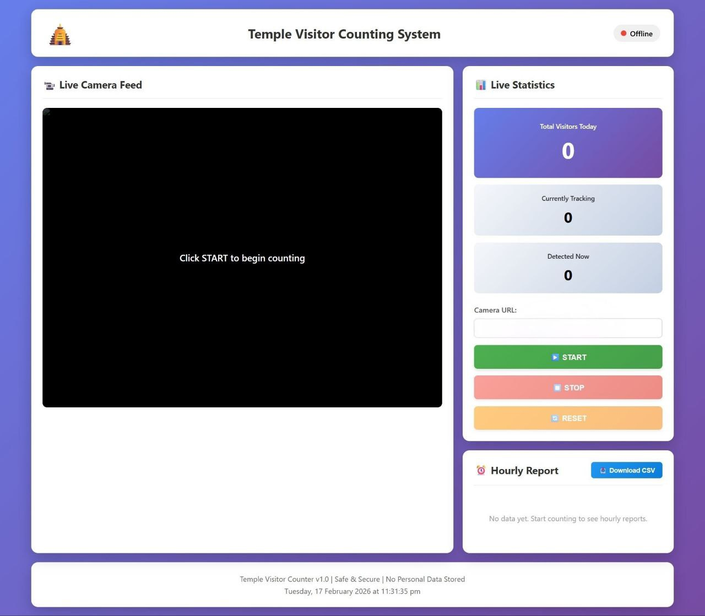

<div align="center">

# 🛕 Temple Visitor Counter

### AI-powered real-time people counting for temples & high-footfall spaces


<br>

**[📺 Demo](#-demonstration) · [🚀 Quick Start](#-getting-started) · [📖 Docs](#-system-architecture)**

<br>

> *Count every devotee. Store no personal data. Know your crowd.*

</div>

---
## Dashboard



---
## 📋 Table of Contents

- [Overview](#-overview)
- [Key Features](#-key-features)
- [Demonstration](#-demonstration)
- [System Architecture](#-system-architecture)
- [Technical Implementation](#️-technical-implementation)
- [Project Structure](#-project-structure)
- [Getting Started](#-getting-started)
- [Technical Details](#-technical-details)
- [Educational Value](#-educational-value)
- [Author](#-author)
- [License](#-license)
- [Acknowledgements](#-acknowledgements)

---

## 🔍 Overview

**Temple Visitor Counter** is a deployment-ready prototype that uses **YOLOv8** object detection and a custom **centroid-based multi-object tracker** to count people crossing a configurable virtual line — in real time, over a live IP camera stream — without storing any personally identifiable information.

The system streams live annotated video to a browser-based dashboard, saves hourly CSV snapshots, and exposes a clean REST API — making it suitable for a Raspberry Pi at a small temple gate or a GPU workstation at a larger site.

```
Camera Feed → YOLOv8 Detection → Centroid Tracker → Line Crossing → Live Dashboard
                                                                   → Hourly CSV
```

|  |  |
|---|---|
| **Detection Model** | YOLOv8n (COCO class 0 — person) |
| **Tracking** | Centroid-based with disappearance tolerance |
| **Counting Logic** | Virtual horizontal line; configurable direction |
| **Interface** | Flask + responsive HTML/CSS/JS Dashboard |
| **Privacy** | No face recognition · No images stored · No PII |
| **Hardware** | Laptop with CPU and optional CUDA-enabled GPU for faster inference |

---

## ✨ Key Features

| Feature | Description |
|---|---|
| 🎯 **Real-Time AI Detection** | YOLOv8n detects persons per frame with configurable confidence, size, and aspect-ratio filters |
| 🧭 **Smart Line Crossing** | Virtual counting line at configurable height; tracks downward, upward, or both-direction crossings |
| 🆔 **Multi-Object Tracking** | Centroid tracker with disappearance tolerance — each person gets a unique ID, a `counted` set prevents double-counting within a session |
| ⚡ **GPU Acceleration** | Auto CUDA detection; `model.half()` FP16 enabled automatically when GPU is present |
| 📊 **Live Dashboard** | Real-time stats, annotated MJPEG video stream, hourly report list, online/offline status indicator |
| 📁 **Hourly CSV Snapshots** | Count saved to CSV every hour while running, and once more automatically on stop |
| 🔒 **Privacy First** | No face recognition, no image storage, no personal identifiers at any stage |
| 📡 **Any IP Camera** | Connects to any HTTP-streaming source — Android/iOS apps, CCTV, or USB webcam |
| 📱 **Responsive UI** | CSS grid layout adapts from wide-screen monitor to tablet |

---

## 📺 Demonstration

### Dashboard Layout

```
┌─────────────────────────────────────────────────────────────────┐
│  🛕 Temple Visitor Counting System             ● Online          │
├──────────────────────────────────┬──────────────────────────────┤
│                                  │  📊 Live Statistics          │
│    [ Annotated Camera Feed ]     │  ┌────────────────────────┐  │
│                                  │  │  Total Visitors Today  │  │
│   ┌─── ID:1 ───┐                 │  │         1,247          │  │
│   │  [Person]  │                 │  └────────────────────────┘  │
│   └────────────┘                 │  Tracking: 3  Detected: 3    │
│  ──────── COUNTING LINE ────────  │                              │
│                                  │  Camera URL: [_________]     │
│                                  │  [▶ START] [⏹ STOP] [🔄]   │
├──────────────────────────────────┴──────────────────────────────┤
│  ⏰ Hourly Report                              [📥 Download CSV] │
│  ⏰ 14:00  ·····················  312 people                    │
│  ⏰ 13:00  ·····················  489 people                    │
└─────────────────────────────────────────────────────────────────┘
```

### What Appears on the Live Feed

- 🟩 **Green boxes** — detected persons with confidence score
- 🔵 **Blue dots + ID labels** — tracked object IDs
- 🔴/🔵/🟡 **Horizontal line** — counting line (colour changes with direction setting)
- 🟦 **Top-left overlay** — live total count, currently tracking, FPS

---

## 🏗 System Architecture

### Data Flow

```
┌──────────────┐    ┌───────────────┐    ┌──────────────┐    ┌──────────────┐
│  IP Camera   │───▶│    OpenCV     │───▶│   YOLOv8n   │───▶│   Centroid   │
│ (HTTP/RTSP)  │    │ VideoCapture  │    │  Detector   │    │   Tracker    │
└──────────────┘    └───────────────┘    └──────────────┘    └──────┬───────┘
                                                                     │
              ┌──────────────────────────────────────────────────────▼───────┐
              │                   Line Crossing Check                         │
              │              (prev_y → cY crosses line_y)                    │
              └──────────────────────────────────────────────────────┬───────┘
                                                                     │
         ┌───────────────────┐    ┌──────────────────────┐    ┌──────▼───────┐
         │  CSV / Logs       │◀───│   Flask REST API     │◀───│  Counter++   │
         │  (Pandas)         │    │  + MJPEG Stream      │    │  total_count │
         └───────────────────┘    └──────────┬───────────┘    └──────────────┘
                                             │
                                    ┌────────▼────────┐
                                    │   Browser UI    │
                                    │  (Dashboard)    │
                                    └─────────────────┘
```

### Threading Model

```
Main Thread (Flask)               Background Daemon Thread
─────────────────────             ──────────────────────────────────
Handle HTTP requests    ←──  CounterState + threading.Lock()  ──→  Read camera frame
Serve /video_feed                                                    Run YOLOv8 inference
Serve /api/*                                                         Update tracker
                                                                     Check line crossing
                                                                     Write frame to state
                                                                     Save hourly CSV
```

Every frame write uses `with state.lock` to prevent race conditions between the processing thread and the MJPEG stream generator.

### Component Roles

| File | Responsibility |
|---|---|
| `config.py` | Single source of truth — all tuneable parameters and directory auto-creation |
| `detector.py` | `PersonDetector` — YOLOv8 inference with confidence, size, and aspect-ratio filtering |
| `tracker.py` | `PersonTracker` — centroid matching, disappearance counter, line-crossing detection |
| `app.py` | Flask app, REST endpoints, MJPEG stream, background processing thread |
| `dashboard.html` | SPA shell — live video, stat cards, controls, hourly list |
| `script.js` | Async fetch calls to API, 2s stats polling, visibility-aware pause/resume |
| `style.css` | Responsive CSS grid, animated status dot, scrollable hourly list |

---

## ⚙️ Technical Implementation

### 1. Person Detection (`detector.py`)

YOLOv8n (nano) is chosen for its speed-accuracy balance. The model is loaded once at startup, warmed up with a dummy frame, and reused for every subsequent frame.

**Filters applied after YOLO inference:**

| Filter | Value | Purpose |
|---|---|---|
| Confidence | `0.35` | Catches partially visible people |
| Input size | `640 px` | Standard YOLO input |
| IOU threshold | `0.45` | Separates closely-standing people |
| Max detections | `10` | Sufficient for a typical gate width |
| Min bbox height | `60 px` | Ignores people very far from camera |
| Max bbox height | `700 px` | Ignores foreground objects |
| Aspect ratio | `height/width ≥ 0.5` | Rejects wide horizontal detections |
| FP16 | Auto when CUDA | `model.half()` called if GPU detected |

### 2. Centroid Tracking (`tracker.py`)

Written from scratch — no external tracking library used.

Each frame:
1. Compute centroids `(cX, cY)` from detection bounding box midpoints
2. Build pairwise Euclidean distance matrix: `scipy.spatial.distance.cdist`
3. Match existing IDs to new detections within `MAX_DISTANCE` (120 px)
4. Unmatched detections → new IDs registered
5. Unmatched existing IDs → disappearance counter incremented
6. IDs unseen for `MAX_DISAPPEARED` (15 frames ≈ 0.5s at 30 FPS) → deregistered

### 3. Line Crossing & Counting (`tracker.py`)

```python
# Downward crossing — person enters from top
if prev_y < line_y and cY >= line_y:
    if count_direction in ['down', 'both']:
        total_count += 1
        counted.add(object_id)   # prevents counting same ID twice

# Upward crossing — person enters from bottom
elif prev_y > line_y and cY <= line_y:
    if count_direction in ['up', 'both']:
        total_count += 1
        counted.add(object_id)
```

`prev_positions` stores each ID's previous Y coordinate, enabling direction detection across frames.

### 4. REST API (`app.py`)

All endpoints implemented and return JSON.

| Endpoint | Method | What it does |
|---|---|---|
| `/` | `GET` | Renders `dashboard.html` via Jinja2 |
| `/video_feed` | `GET` | MJPEG multipart stream from `generate_frames()` |
| `/api/start` | `POST` | Accepts `{"camera_url"}`, initialises detector + tracker, starts daemon thread |
| `/api/stop` | `POST` | Sets `is_running = False`, releases camera, writes CSV snapshot |
| `/api/reset` | `POST` | Calls `tracker.reset_count()`, clears `hourly_data` list |
| `/api/stats` | `GET` | Returns `total_count`, `current_tracking`, `current_detections`, `is_running`, last 10 hourly entries |
| `/api/download` | `GET` | Streams today's CSV via `send_file(..., as_attachment=True)` |

### 5. Frontend (`script.js`)

- `startSystem()` — validates URL format (`http://` or `https://`), POSTs to `/api/start`, sets `` on success
- `updateStats()` — polls `/api/stats` every 2 seconds, updates DOM counters and hourly list
- `visibilitychange` listener — pauses polling when browser tab is hidden, resumes on return
- `downloadCSV()` — navigates to `/api/download` to trigger browser file download
- Camera URL saved to `localStorage` and restored on page reload

---

## 📁 Project Structure

```
temple-visitor-counter/
├── app.py                      # Flask app, REST API, MJPEG stream, processing thread
├── config.py                   # All tuneable parameters
├── detector.py                 # YOLOv8 person detection class
├── tracker.py                  # Centroid tracker + line-crossing counter
├── requirements.txt            # Python dependencies
│
├── templates/
│   └── dashboard.html          # Single-page dashboard (Jinja2)
│
├── static/
│   ├── style.css               # Responsive CSS
│   └── script.js               # Frontend JS
│
├── screenshots/
│   └── dashboard.png           # Dashboard screenshot (shown in README)
│
├── data/
│   └── counts/                 # Auto-created on first run
│       └── Temple_Count_YYYY-MM-DD.csv
│
└── logs/
    └── temple_counter.log      # Application log (stdout + file)
```

---

## 🚀 Getting Started

### Prerequisites

- Python 3.8+
- pip
- *(Optional)* NVIDIA GPU with CUDA 11.8+ for faster inference
- A camera: USB webcam, IP Webcam app (Android/iOS), or any HTTP/RTSP stream

### Installation

```bash
# 1. Clone the repo
git clone https://github.com/Sameeksha-S-Bhat/realtime-temple-visitor-counter.git
cd realtime-temple-visitor-counter

# 2. Create a virtual environment
python -m venv venv
source venv/bin/activate          # Linux / macOS
# .\venv\Scripts\activate         # Windows

# 3. Install dependencies
pip install flask flask-cors opencv-python ultralytics scipy pandas

# GPU users — replace cu118 with your CUDA version
pip install torch torchvision --index-url https://download.pytorch.org/whl/cu118
```

### Configuration

Edit `config.py` before first run:

```python
CAMERA_URL           = "http://192.168.1.100:8080/video"  # Your camera stream
CONFIDENCE_THRESHOLD = 0.35    # Lower = more detections
LINE_POSITION        = 0.6     # 0.0 = top of frame, 1.0 = bottom
COUNT_DIRECTION      = "down"  # "down" | "up" | "both"
```

### Run

```bash
python app.py
```

Open http://localhost:5000 in your browser, enter your camera URL, click ▶ START.

### Using Your Phone as a Camera

1. Install **[IP Webcam](https://play.google.com/store/apps/details?id=com.pas.webcam)** (Android) or **EpocCam** (iOS)
2. Connect phone and PC to the same Wi-Fi network
3. Start the app — note the stream URL
4. Paste it into the dashboard and click **▶ START**

---

## 🔧 Technical Details

### Configuration Reference

| Parameter | Default | Effect |
|---|---|---|
| `CONFIDENCE_THRESHOLD` | `0.35` | Lower → more detections, more false positives |
| `MIN_PERSON_HEIGHT` | `60 px` | Raise to ignore far-away people |
| `MAX_PERSON_HEIGHT` | `700 px` | Lower to reduce foreground noise |
| `MAX_DISAPPEARED` | `15` | Frames before an ID is dropped (~0.5s at 30 FPS) |
| `MAX_DISTANCE` | `120 px` | Max centroid jump allowed between frames |
| `LINE_POSITION` | `0.6` | 60% from top of frame |
| `COUNT_DIRECTION` | `"down"` | `"down"` \| `"up"` \| `"both"` |
| `SAVE_INTERVAL` | `3600 s` | How often CSV is written while running |
| `FPS` | `30` | Target camera capture frame rate |

### Core Dependencies

| Package | Role |
|---|---|
| `ultralytics` | YOLOv8 model loading, inference, GPU acceleration |
| `opencv-python` | Camera capture, frame decoding, annotation, JPEG encoding |
| `torch` | Deep learning backend; CUDA support |
| `flask` | Web framework — HTTP API and MJPEG streaming |
| `flask-cors` | Cross-Origin Resource Sharing |
| `scipy` | `cdist` for pairwise Euclidean distance in tracker |
| `pandas` | Hourly data aggregation and CSV I/O |
| `numpy` | Centroid array operations |

---

## 🎓 Educational Value

This project demonstrates practical implementation of several computer vision and software engineering concepts:

- **Computer Vision** — end-to-end detection pipeline: model loading, warmup, inference, post-filtering, annotation
- **Object Tracking** — centroid-based tracker built from scratch using distance matrices
- **Multithreaded Systems** — shared mutable state between Flask HTTP thread and background processing thread, protected by mutex lock
- **Full-Stack Integration** — Python backend, REST API, MJPEG stream, vanilla JS frontend with no build tools
- **GPU Programming** — CUDA device detection, model transfer, FP16 quantisation
- **Privacy by Design** — counting without identifying; no biometric data collection

---

## 👤 Author

**Sameeksha S Bhat**
- GitHub: [@Sameeksha-S-Bhat](https://github.com/Sameeksha-S-Bhat)
- LinkedIn: [Sameeksha S Bhat](https://linkedin.com/in/sameeksha-s-bhat-2a7341336)

---

## 📄 License

This project is licensed under the **MIT License** — see the [LICENSE](LICENSE) file for details.

---

## 🙏 Acknowledgements

- **Ultralytics** — for making YOLOv8 accessible to every developer
- **OpenCV** — foundational computer vision infrastructure
- **PyImageSearch** — centroid tracker tutorial that informed the tracking design
- **Flask** and **SciPy** — well-documented, reliable open-source libraries

---
